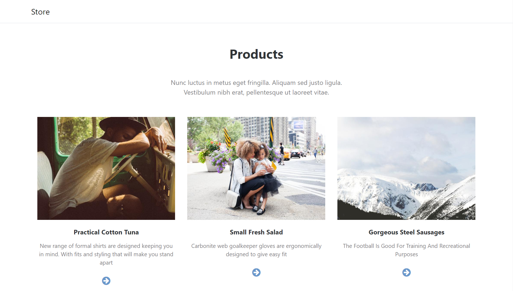
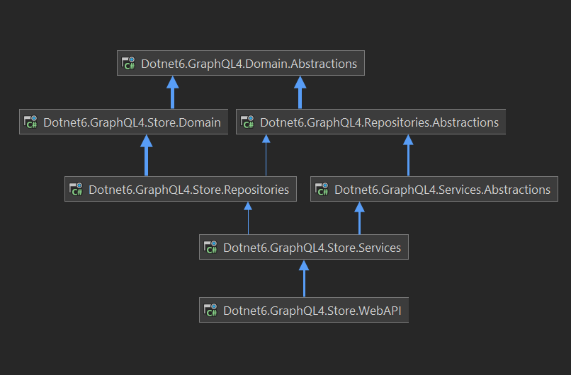
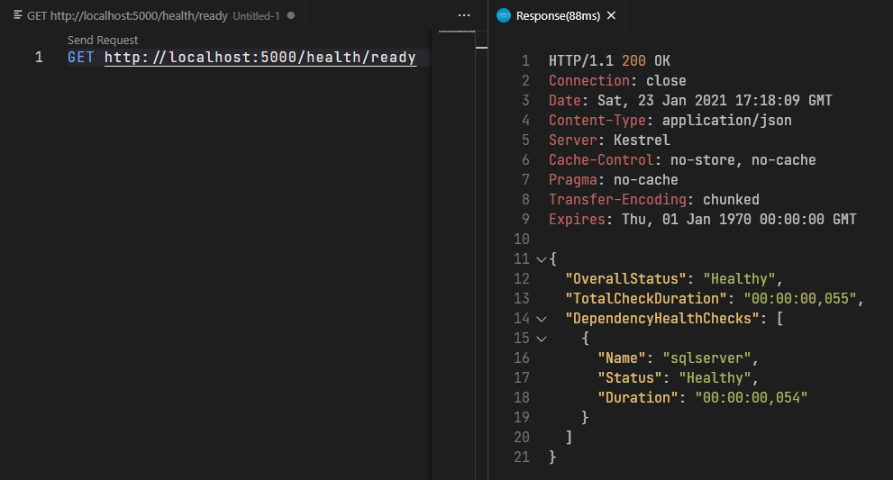
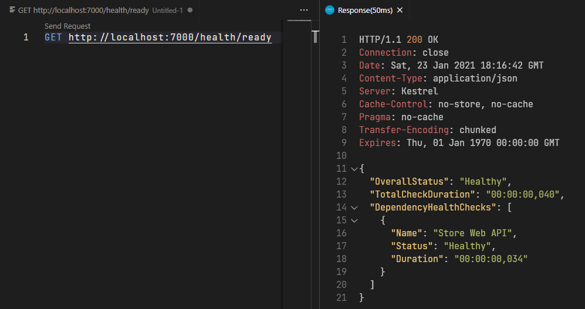
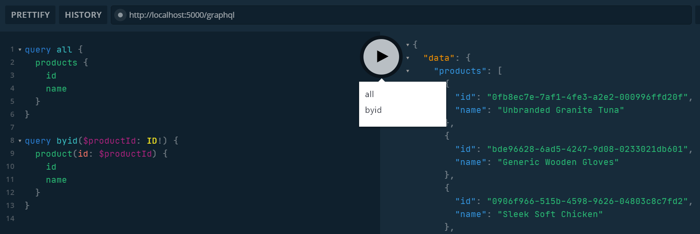

# Dotnet6.GraphQL4.WebApplication

This project exemplifies the implementation and **dockerization** of a simple Razor Web MVC Core consuming a full **GraphQL 4** Web API, build in a **.NET 6** multi-layer project, considering development best practices, like **SOLID**, **KISS** and **DRY**, applying **Domain-Driven** concepts in a **Hexagonal Architecture**.

### Give a Star! :star:

|WebAPI|
|:----:| 
|[](https://github.com/AntonioFalcao/Dotnet6.GraphQL4.WebApplication/actions/workflows/build-and-test.yml) [](https://github.com/AntonioFalcao/Dotnet6.GraphQL4.WebApplication/actions/workflows/build-and-test.yml) [](https://github.com/AntonioFalcao/Dotnet6.GraphQL4.WebApplication/actions/workflows/webapi-docker-publish.yml) [](https://github.com/AntonioFalcao/Dotnet6.GraphQL4.WebApplication/actions/workflows/codeql-analysis.yml) [](https://www.codacy.com/gh/AntonioFalcao/Dotnet6.GraphQL4.WebApplication/dashboard?utm_source=github.com&amp;utm_medium=referral&amp;utm_content=AntonioFalcao/Dotnet6.GraphQL4.WebApplication&amp;utm_campaign=Badge_Grade) [](https://hub.docker.com/repository/docker/antoniofalcaojr/dotnet6-graphql4-webapi)|                
|**WebMVC**|
|[](https://github.com/AntonioFalcao/Dotnet6.GraphQL4.WebApplication/actions/workflows/build-and-test.yml) [](https://github.com/AntonioFalcao/Dotnet6.GraphQL4.WebApplication/actions/workflows/webmvc-docker-image.yml) [](https://github.com/AntonioFalcao/Dotnet6.GraphQL4.WebApplication/actions/workflows/webmvc-docker-publish.yml) [](https://github.com/AntonioFalcao/Dotnet6.GraphQL4.WebApplication/actions/workflows/codeql-analysis.yml) [](https://www.codacy.com/gh/AntonioFalcao/Dotnet6.GraphQL4.WebApplication/dashboard?utm_source=github.com&amp;utm_medium=referral&amp;utm_content=AntonioFalcao/Dotnet6.GraphQL4.WebApplication&amp;utm_campaign=Badge_Grade) [](https://hub.docker.com/repository/docker/antoniofalcaojr/dotnet6-graphql4-webmvc)|

**Oldest version**: Dotnet**5**.GraphQL**3**.WebApplication

|WebAPI|[](https://hub.docker.com/repository/docker/antoniofalcaojr/dotnet5-graphql3-webapi)|
|:----:|--- |
|**WebMVC**|[](https://hub.docker.com/repository/docker/antoniofalcaojr/dotnet5-graphql3-webmvc)|



---



---

## Running

### Development (secrets)
 
To configure database resource, `init` secrets in [`./src/Dotnet6.GraphQL4.Store.WebAPI`](./src/Dotnet6.GraphQL4.Store.WebAPI), and then define the `DefaultConnection`:

```bash
dotnet user-secrets init
dotnet user-secrets set "ConnectionStrings:DefaultConnection" "Server=localhost,1433;Database=Store;User=sa;Password=!MyComplexPassword"
```

After this, to configure the HTTP client, `init` secrets in [`./src/Dotnet6.GraphQL4.Store.WebMVC`](./src/Dotnet6.GraphQL4.Store.WebMVC) and define **Store** client host:

```bash
dotnet user-secrets init
dotnet user-secrets set "HttpClient:Store" "http://localhost:5000"
```

##### AppSettings

If you prefer, is possible to define it on WebAPI [`appsettings.Development.json`](./src/Dotnet6.GraphQL4.Store.WebAPI/appsettings.Development.json) and WebMVC [`appsettings.Development.json`](./src/Dotnet6.GraphQL4.Store.WebMVC/appsettings.Development.json) files:

WebAPI

```json5
{
  "ConnectionStrings": {
    "DefaultConnection": "Server=localhost,1433;Database=Store;User=sa;Password=!MyComplexPassword"
  }
}
```

WebMCV

```json5
{
  "HttpClient": {
    "Store": "http://localhost:5000"
  }
}
```

### Production

Considering use Docker for CD (Continuous Deployment). On respective [compose](./docker-compose.yml) both web applications and sql server are in the same network, and then we can use named hosts. Already defined on WebAPI [`appsettings.json`](./src/Dotnet6.GraphQL4.Store.WebAPI/appsettings.json) and WebMVC [`appsettings.json`](./src/Dotnet6.GraphQL4.Store.WebMVC/appsettings.json) files:

#### AppSettings

WebAPI

```json5
{
  "ConnectionStrings": {
    "DefaultConnection": "Server=mssql;Database=Store;User=sa;Password=!MyComplexPassword"
  }
}
```

WebMCV

```json5
{
  "HttpClient": {
    "Store": "http://webapi:5000"
  }
}
```

### Docker

The [`./docker-compose.yml`](./docker-compose.yml) provide the `WebAPI`, `WebMVC` and `MS SQL Server` applications:

```bash
docker-compose up -d
``` 

It's possible to run without a clone of the project using the respective compose:

```yaml
version: "3.7"

services:
  mssql:
    container_name: mssql
    image: mcr.microsoft.com/mssql/server
    ports:
      - 1433:1433
    environment:
      SA_PASSWORD: "!MyComplexPassword"
      ACCEPT_EULA: "Y"
    healthcheck:
      test: /opt/mssql-tools/bin/sqlcmd -S localhost -U sa -P "$$SA_PASSWORD" -Q "SELECT 1" || exit 1
      interval: 10s
      timeout: 3s
      retries: 10
      start_period: 10s
    networks:
      - graphqlstore

  webapi:
    container_name: webapi
    image: antoniofalcaojr/dotnet6-graphql4-webapi
    environment:
      - ASPNETCORE_URLS=http://*:5000
    ports:
      - 5000:5000
    depends_on:
      mssql:
        condition: service_healthy
    networks:
      - graphqlstore

  webmvc:
    container_name: webmvc
    image: antoniofalcaojr/dotnet6-graphql4-webmvc
    environment:
      - ASPNETCORE_URLS=http://*:7000
    ports:
      - 7000:7000
    depends_on:
      - webapi
    networks:
      - graphqlstore

  healthchecks:
    container_name: healthchecks-ui
    image: xabarilcoding/healthchecksui
    depends_on:
      mssql:
        condition: service_healthy
    environment:
      - storage_provider=SqlServer
      - storage_connection=Server=mssql;Database=Store;User=sa;Password=!MyComplexPassword
      - Logging:LogLevel:Default=Debug
      - Logging:Loglevel:Microsoft=Warning
      - Logging:LogLevel:HealthChecks=Debug
      - HealthChecksUI:HealthChecks:0:Name=webapi
      - HealthChecksUI:HealthChecks:0:Uri=http://webapi:5000/healthz
      - HealthChecksUI:HealthChecks:1:Name=webmvc
      - HealthChecksUI:HealthChecks:1:Uri=http://webmvc:7000/healthz
    ports:
      - 8000:80
    networks:
      - graphqlstore

networks:
  graphqlstore:
    driver: bridge
```
### GraphQL Playground

By default **Playground** respond at `http://localhost:5000/ui/playground` but is possible configure the host and many others details in [`../DependencyInjection/Extensions/ApplicationBuilderExtensions.cs`](./src/Dotnet6.GraphQL4.Store.WebAPI/DependencyInjection/Extensions/ApplicationBuilderExtensions.cs)

```c#
app.UseGraphQLPlayground(
       options: new() 
       {
           BetaUpdates = true,
           RequestCredentials = RequestCredentials.Omit,
           HideTracingResponse = false,
           EditorCursorShape = EditorCursorShape.Line,
           EditorTheme = EditorTheme.Dark,
           EditorFontSize = 14,
           EditorReuseHeaders = true,
           EditorFontFamily = "JetBrains Mono"
       },
       path: "/ui/playground");
```

### Health checks

Based on cloud-native concepts, **Readiness** and **Liveness** integrity verification strategies were implemented. 

If using [xabarilcoding/healthchecksui](https://github.com/Xabaril/AspNetCore.Diagnostics.HealthChecks/blob/master/doc/ui-docker.md) container image it will responde on `http://localhost:8000/healthchecks-ui/`.

> `/health`   
> Just check if the instance is running.

> `/health/live`  
> Check if the instance is running and all the dependencies too.

> `/health/ready`          
> Check if the instance and all the dependencies are ready to attend to all functionalities.

> `/healthz`          
> HealthReport specific for HealthCheck-UI.

Web API

`http://localhost:5000/health/ready`



Web MVC

`http://localhost:7000/health/ready`



### Dump configuration

It is possible to dump the state of the environment configuration in through the middleware resource `/dump-config` in both applications.

```c#
public void Configure(IApplicationBuilder app)
{
    app.UseEndpoints(endpoints =>
        {
            endpoints.MapDumpConfig(
                pattern: "/dump-config",
                configInfo: (_configuration as IConfigurationRoot).GetDebugView(),
                isDevelopment: _env.IsDevelopment());
        });
}
```
___

## Highlights

### UnitOfWork + Execution Strategy + Transaction Scope

The implementation of the `UnitOfWork` gives support to the `ExecutionStrategy` from **EF Core** with `TransactionScope`.

> **operationAsync**: Encapsulates all desired transactions;    
> **condition**: External control for commitment;    
> **cancellationToken**: The cancellation token to be used within operation.   

```c#
public Task<Review> AddReviewAsync(ReviewModel reviewModel, CancellationToken cancellationToken)
{
    return UnitOfWork.ExecuteInTransactionScopeAsync(
        operationAsync: async ct =>
        {
            var product = await Repository.GetByIdAsync(
                id: reviewModel.ProductId,
                include: products => products.Include(x => x.Reviews),
                asTracking: true,
                cancellationToken: ct);

            var review = Mapper.Map<Review>(reviewModel);
            product?.AddReview(review);
            await OnEditAsync(product, ct);
            return review;
        },
        condition: _ => NotificationContext.AllValidAsync,
        cancellationToken: cancellationToken);      
}
```

### Notifications (pattern/context)

To avoid handle exceptions, was implemented a [`NotificationContext`](./src/Dotnet6.GraphQL4.CrossCutting/Notifications/NotificationContext.cs) that's allow  all layers add business notifications through the request, with support to receive **Domain** notifications, that by other side, implementing validators from **Fluent Validation** and return a `ValidationResult`. 

```c#
protected bool OnValidate<TEntity>(TEntity entity, AbstractValidator<TEntity> validator)
{
    ValidationResult = validator.Validate(entity);
    return IsValid;
}

protected void AddError(string errorMessage, ValidationResult validationResult = default)
{
    ValidationResult.Errors.Add(new ValidationFailure(default, errorMessage));
    validationResult?.Errors.ToList().ForEach(failure => ValidationResult.Errors.Add(failure));
}
```

To the **GraphQL** the notification context delivery a `ExecutionErrors` that is propagated to `result` from execution by a personalised [`Executer`](./src/Dotnet6.GraphQL4.Store.WebAPI/Graphs/Executers/StoreGraphQLExecuter.cs):  

```c#
public override async Task<ExecutionResult> ExecuteAsync(string operationName, string query, Inputs variables, IDictionary<string, object> context, IServiceProvider requestServices, CancellationToken cancellationToken = new CancellationToken())
{
    var result = await base.ExecuteAsync(operationName, query, variables, context, requestServices, cancellationToken);
    var notification = requestServices.GetRequiredService<INotificationContext>();

    if (notification.HasNotifications is false) return result;

    result.Errors = notification.ExecutionErrors;
    result.Data = default;
    
    return result;
}
```

### Resolving `Scoped` dependencies with `Singleton` Schema.

_It's no more necessary after version 4.2.0 from  **GraphQL Server**. By default, the Service Provider is already being propagated._

~~Is necessary, in the same personalised [`Executer`](./src/Dotnet6.GraphQL4.Store.WebAPI/Graphs/Executers/StoreGraphQLExecuter.cs) define the _service provider_ that will be used from `resolvers` on `fields`:~~

```c#
var options = base.GetOptions(operationName, query, variables, context, cancellationToken);
options.RequestServices = _serviceProvider;
```

### Abstractions

With abstract designs, it is possible to reduce coupling in addition to applying **DRY** concepts, providing resources for the main behaviors:

[`...Domain.Abstractions`](./src/Dotnet6.GraphQL4.Domain.Abstractions)

```c#
public abstract class Entity<TId>
    where TId : struct
```

```c#
public abstract class Builder<TBuilder, TEntity, TId> : IBuilder<TEntity, TId>
    where TBuilder : Builder<TBuilder, TEntity, TId>
    where TEntity : Entity<TId>
    where TId : struct
```
    
[`...Repositories.Abstractions`](./src/Dotnet6.GraphQL4.Repositories.Abstractions/Repository.cs)  

```c#
public abstract class Repository<TEntity, TId> : IRepository<TEntity, TId>
    where TEntity : Entity<TId>
    where TId : struct
{
    private readonly DbSet<TEntity> _dbSet;

    protected Repository(DbContext dbDbContext)
    {
        _dbSet = dbDbContext.Set<TEntity>();
    }
```

[`...Services.Abstractions`](./src/Dotnet6.GraphQL4.Services.Abstractions/Service.cs) 

```c#
public abstract class Service<TEntity, TModel, TId> : IService<TEntity, TModel, TId>
    where TEntity : Entity<TId>
    where TModel : Model<TId>
    where TId : struct
{
    protected readonly IMapper Mapper;
    protected readonly INotificationContext NotificationContext;
    protected readonly IRepository<TEntity, TId> Repository;
    protected readonly IUnitOfWork UnitOfWork;

    protected Service(
        IUnitOfWork unitOfWork,
        IRepository<TEntity, TId> repository,
        IMapper mapper,
        INotificationContext notificationContext)
    {
        UnitOfWork = unitOfWork;
        Repository = repository;
        Mapper = mapper;
        NotificationContext = notificationContext;
    }
```

```c#
public abstract class MessageService<TMessage, TModel, TId> : IMessageService<TMessage, TModel, TId>
    where TMessage : class
    where TModel : Model<TId>
    where TId : struct
{
    private readonly IMapper _mapper;
    private readonly ISubject<TMessage> _subject;

    protected MessageService(IMapper mapper, ISubject<TMessage> subject)
    {
        _mapper = mapper;
        _subject = subject;
    }
```

### From `EF TPH` to `GraphQL Interface`

ENTITY

```c#
public class ProductConfig : IEntityTypeConfiguration<Product>
{
    public void Configure(EntityTypeBuilder<Product> builder)
    {
        builder
            .HasDiscriminator()
            .HasValue<Boot>(nameof(Boot))
            .HasValue<Kayak>(nameof(Kayak))
            .HasValue<Backpack>(nameof(Backpack));
    }
}
```

INHERITOR

```c#
public class KayakConfig : IEntityTypeConfiguration<Kayak>
{
    public void Configure(EntityTypeBuilder<Kayak> builder)
    {
        builder
            .HasBaseType<Product>();
    }
}
```

INTERFACE 

```c#
public sealed class ProductInterfaceGraphType : InterfaceGraphType<Product>
{
    public ProductInterfaceGraphType(BootGraphType bootGraphType, BackpackGraphType backpackGraphType, KayakGraphType kayakGraphType)
    {
        Name = "product";

        ResolveType = @object =>
        {
            return @object switch
            {
                Boot _ => bootGraphType,
                Backpack _ => backpackGraphType,
                Kayak _ => kayakGraphType,
                _ => default
            };
        };
    }
}
```

OBJECT

```c#
public sealed class KayakGraphType : ObjectGraphType<Kayak>
{
    public KayakGraphType()
    {
        Name = "kayak";
        Interface<ProductInterfaceGraphType>();
        IsTypeOf = o => o is Product;
    }
}
```

___


## Queries

#### Fragment for comparison and Arguments

QUERY

```markdown
{
  First: product(id: "2c05b59b-8fb3-4cba-8698-01d55a0284e5") {
    ...comparisonFields
  }
  Second: product(id: "65af82e8-27f6-44f3-af4a-029b73f14530") {
    ...comparisonFields
  }
}

fragment comparisonFields on product {
  id
  name
  rating
  description
}
```
RESULT

```json5
{
  "data": {
    "First": {
      "id": "2c05b59b-8fb3-4cba-8698-01d55a0284e5",
      "name": "libero",
      "rating": 5,
      "description": "Deleniti voluptas quidem accusamus est debitis quisquam enim."
    },
    "Second": {
      "id": "65af82e8-27f6-44f3-af4a-029b73f14530",
      "name": "debitis",
      "rating": 10,
      "description": "Est veniam unde."
    }
  }
}
```
___

#### Query named's and Variables

QUERY

```markdown
query all {
  products {
    items {
      id
      name
    }
  }
}

query byid($productId: Guid!) {
  product(id: $productId) {
    id
    name
  }
}
```

VARIABLES

```json5
{
  "productId": "2c05b59b-8fb3-4cba-8698-01d55a0284e5"
}
```

HTTP BODY

```markdown
{
    "operationName": "byid",
    "variables": {
        "productId": "2c05b59b-8fb3-4cba-8698-01d55a0284e5"
    },
    "query": "query all {
        products {
          items {          
            id
            name
         }
       }
    }
    query byid($productId: Guid!) {
        product(id: $productId) {
          id
          name
        }
    }"
}
```

PLAYGROUND

 
___
#### Variables with include, skip and default value

QUERY

```markdown
query all($showPrice: Boolean = false) {
  products {
    items {
      id
      name
      price @include(if: $showPrice)
      rating @skip(if: $showPrice)
    }
  }
}
```

VARIABLES

```json5
{
  "showPrice": true
}
```

HTTP BODY

```markdown
{
    "operationName": "all",
    "variables": {
        "showPrice": false
    },
    "query": "query all($showPrice: Boolean = false) {
          products {
            items {
              id
              name
              price @include(if: $showPrice)
              rating @skip(if: $showPrice)
            }
        }
    }"
}
```
___
### Pagination

QUERY

```markdown
{
  products(pageParams: { index: 2, size: 1 }) {
    items {
      id
    }
    pageInfo {
      current
      hasNext
      hasPrevious
      size
    }
  }
}
```

RESULT

```json5
{
  "data": {
    "products": {
      "items": [
        {
          "id": "3b2f6ce4-1b1d-4376-80a6-0b8d51932757"
        }
      ],
      "pageInfo": {
        "current": 2,
        "hasNext": true,
        "hasPrevious": true,
        "size": 1
      }
    }
  }
}
```

___

## Mutations

MUTATION

> Creating / adding a new Review to the respective product.

```markdown
mutation($review: reviewInput!) {
  createReview(review: $review) {
    id
  }
}
```
VARIABLES

```json5
{
  "review": {
    "title": "some title",
    "comment": "some comment",
    "productId": "0fb8ec7e-7af1-4fe3-a2e2-000996ffd20f"
  }
}
```

RESULT

```json5
{
  "data": {
    "createReview": {
      "title": "some title"
    }
  }
}
```
___

## Subscriptions

SUBSCRIPTION

> The Mutation stay listening if a new review is added.

```markdown
subscription {
  reviewAdded {
    title
  }
}

```
RESULT

```json5
{
  "data": {
    "reviewAdded": {
      "title": "Some title"
    }
  }
}
```
___

## Built With

### Microsoft Stack - v6 - preview 2

* [.NET 6](https://devblogs.microsoft.com/dotnet/announcing-net-6-preview-2/) - Base framework;
* [ASP.NET 6](https://devblogs.microsoft.com/aspnet/asp-net-core-updates-in-net-6-preview-2/) - Web framework;
* [Entity Framework Core 6](https://devblogs.microsoft.com/dotnet/announcing-entity-framework-core-6-0-preview-2/) - ORM;
* [Microsoft SQL Server on Linux for Docker](https://hub.docker.com/_/microsoft-mssql-server) - Database.

### GraphQL Stack - v4

* [GraphQL](https://graphql.org/) - GraphQL is a query language for APIs and a runtime for fulfilling those queries with data;
* [GraphQL for .NET](https://github.com/graphql-dotnet/graphql-dotnet/) - This is an implementation of GraphQL in .NET;
* [GraphQL Client](https://github.com/graphql-dotnet/graphql-client) - A GraphQL Client for .NET over HTTP;
* [GraphQL Playground](https://github.com/prisma-labs/graphql-playground/) - GraphQL IDE for better development workflows.

### Community Stack

* [AutoMapper](https://automapper.org/) - A convention-based object-object mapper;
* [FluentValidation](https://fluentvalidation.net/) - A popular .NET library for building strongly-typed validation rules;
* [Bogus](https://github.com/bchavez/Bogus) - A simple and sane fake data generator for C#, F#, and VB.NET;
* [Bootstrap](https://getbootstrap.com/) - The most popular HTML, CSS, and JS library in the world.
* [Serilog](https://serilog.net/) - Serilog provides diagnostic logging to files, the console, and elsewhere.

## Contributing

All contributions are welcome. Please take a look at [contributing](./CONTRIBUTING.md) guide.

## Versioning

We use [SemVer](http://semver.org/) for versioning. For the versions available, see the [tags on this repository](https://github.com/AntonioFalcao/Dotnet6.GraphQL4.WebApplication/tags).

## Authors

> See the list of [contributors](https://github.com/AntonioFalcao/Dotnet6.GraphQL4.WebApplication/graphs/contributors) who participated in this project.

## License

This project is licensed under the MIT License - see the [LICENSE](./LICENSE) file for details
